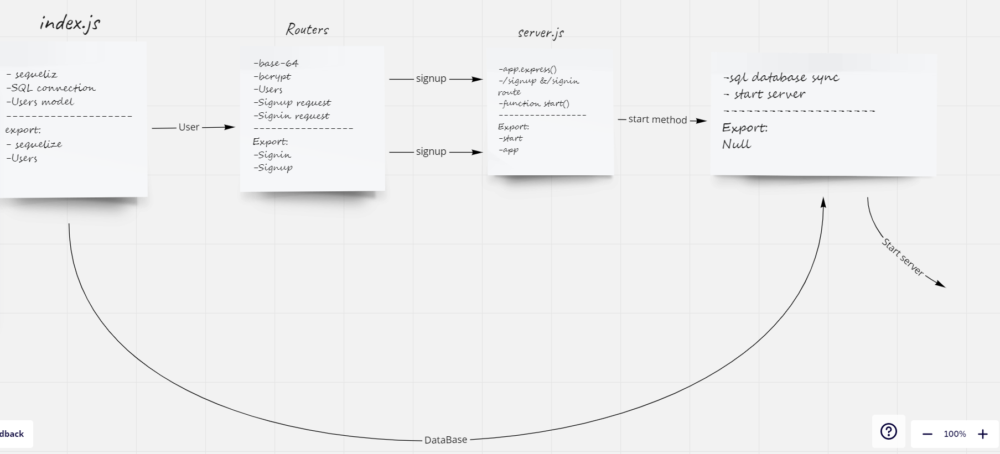

# basic-auth
- Create files for the project.
- import the important packages like sequrlize and express etc.
- create server , root index , router and middlewear.
- create /signin and /signup route .
- and test the routes.

## Path and body

/signup

/signin

body{
- username take string
- password take string
}

## Links

- [Pull Request ](https://github.com/WalidAlrefai/basic-auth/pull/1)
- [Heroku](https://walid-basic-auth.herokuapp.com/)
- [Action](https://github.com/WalidAlrefai/basic-auth/actions)

## UML

